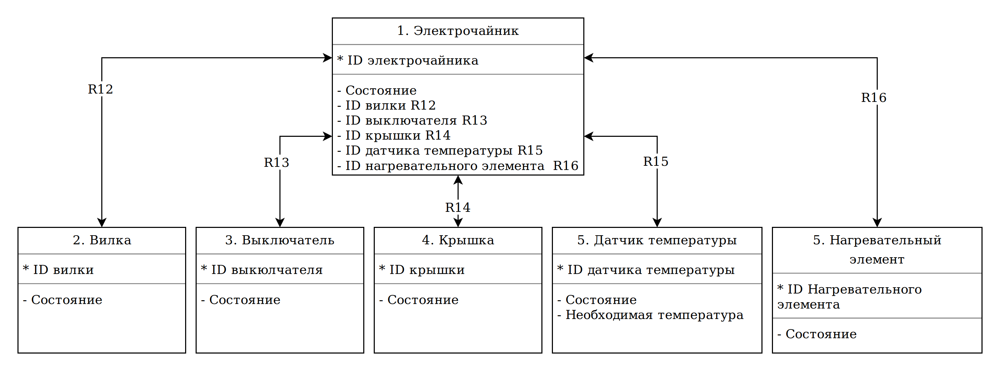
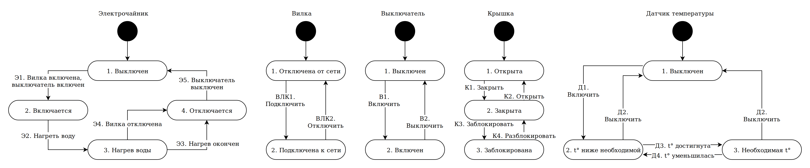
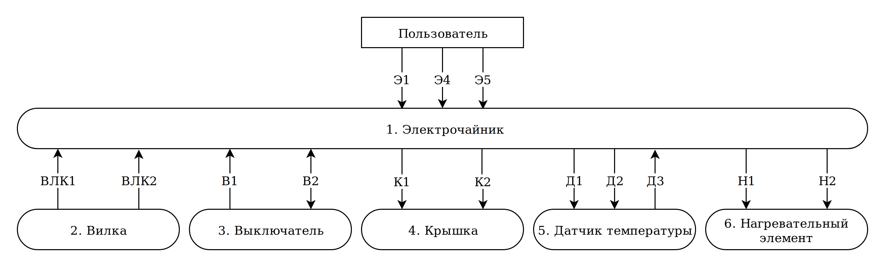
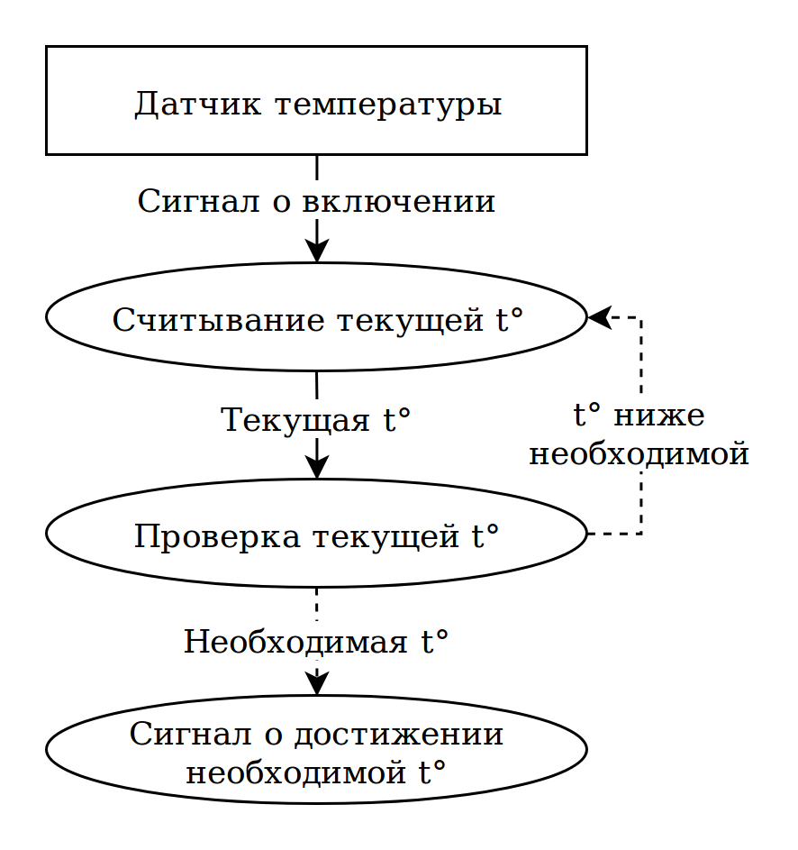

## Сущность-связь

## ДПС

## МВО

## Канал управления
1. Вилка подключается к сети
2. Выключатель включается
3. Крышка заблокирована
4. Датчик температуры включен
5. Нагревательный элемент включен, вода нагревается
6. Срабатывает датчик температуры
7. Нагревательный элемент отключается
8. Датчик температуры отключается
9. Крышка разблокирована
10. Выключатель выключен
11. Вилка отключается

## ДПДД

